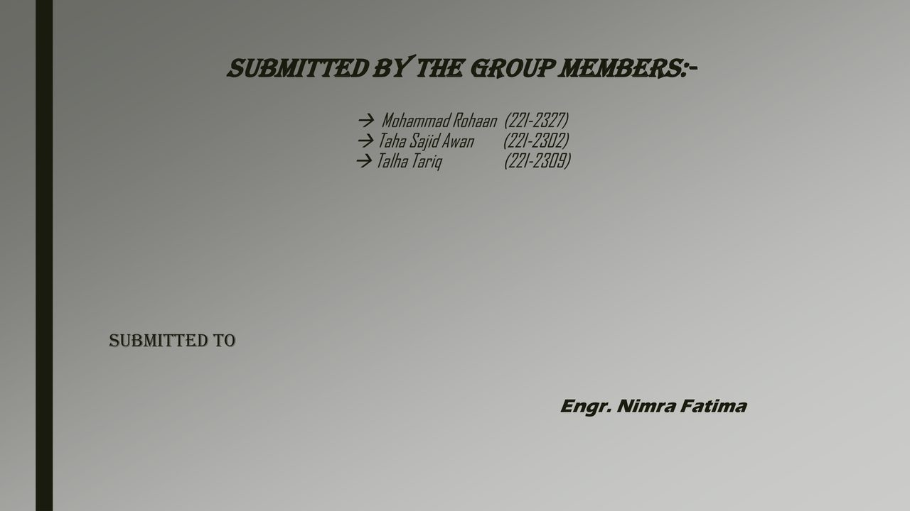
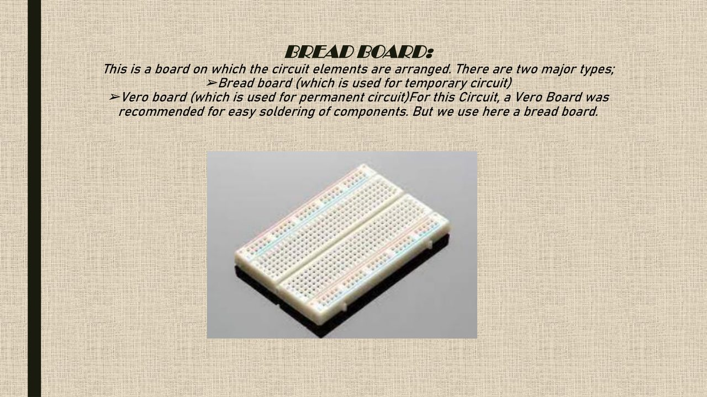
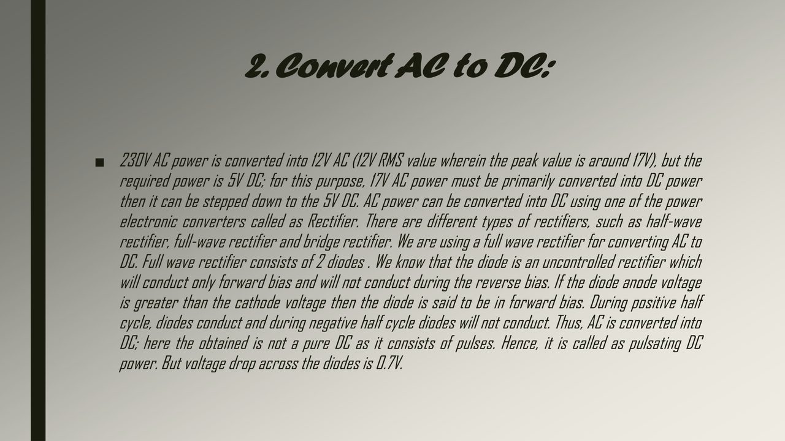
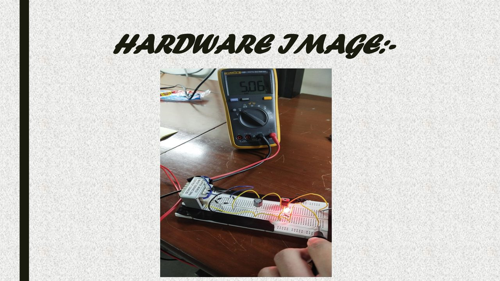
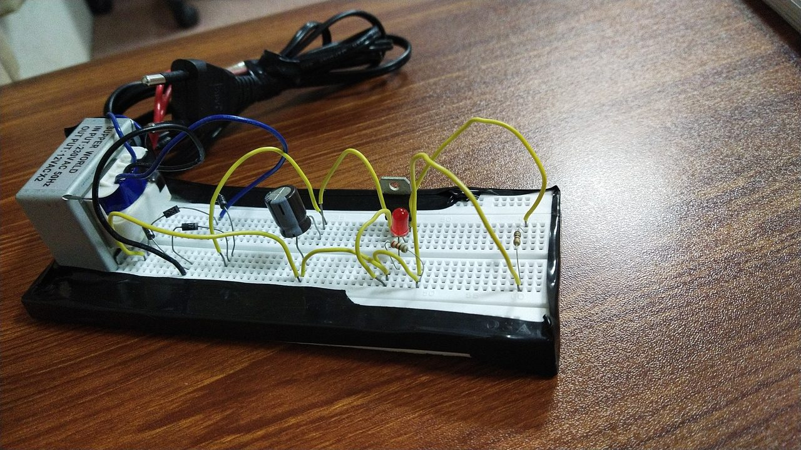

# Circuit Analysis — 5 V DC Supply Lab

[](https://github.com/rohaan2802/Circuit-Analysis)
[](docs/pinouts.md)
[](#measured-result)
[](#feature-screenshots)

Hardware lab archive for a **regulated 5 V DC power supply**:

`mains → step-down transformer → bridge rectifier → capacitive filter → LM7805 → LED + 1 kΩ load`

Includes the graded **20-slide PDF**, breadboard photos, **two live videos**, **20 labelled feature screenshots**, and a rebuild pack (BOM, pinouts, wiring / safety / troubleshooting checklists, measurement log). **No software build** — open PDF, images, and MP4s with any standard viewer.

**Author:** Mohammad Rohaan · **Roll:** 22I-2327 · **GitHub:** [rohaan2802](https://github.com/rohaan2802)

---

## Live demo

Primary live capture (breadboard power-on / measurement moment):

https://github.com/rohaan2802/Circuit-Analysis/blob/main/video_20221205_163544.mp4

Secondary live capture:

https://github.com/rohaan2802/Circuit-Analysis/blob/main/video_20221205_163700.mp4

Full graded presentation (PDF):

https://github.com/rohaan2802/Circuit-Analysis/blob/main/5%20VOLT%20DC%20SUPPLY.pdf

Hardware still (5 Dec 2022):

https://github.com/rohaan2802/Circuit-Analysis/blob/main/IMG_20221205_163654.jpg

Secondary hardware angle (7 Dec 2022):

https://github.com/rohaan2802/Circuit-Analysis/blob/main/IMG-20221207-WA0006.jpeg

---

## Table of contents

1. [What this archive is](#what-this-archive-is)
2. [Live demo](#live-demo)
3. [Quick start](#quick-start)
4. [Extra lab features (rebuild pack)](#extra-lab-features-rebuild-pack)
5. [Feature screenshots (20)](#feature-screenshots-20)
6. [Deep feature walkthrough](#deep-feature-walkthrough)
7. [Block diagram](#block-diagram-signal-path)
8. [Acceptance criteria](#acceptance-criteria)
9. [PDF metadata](#pdf-metadata)
10. [Objectives and introduction](#objectives-and-introduction)
11. [Apparatus list](#apparatus-list)
12. [Stage-by-stage theory](#stage-by-stage-theory)
13. [Conversion procedure](#conversion-procedure)
14. [Measured result](#measured-result)
15. [Inconsistencies in the write-up](#inconsistencies-in-the-write-up)
16. [Repository layout](#repository-layout)
17. [How to use the archive](#how-to-use-the-archive)
18. [Safety](#safety)
19. [Limitations](#limitations)
20. [Author](#author)

---

## What this archive is

Course **final project presentation** for a breadboard 5 V regulated supply submitted to **Engr. Nimra Fatima**.

| Member | Roll |
|--------|------|
| Mohammad Rohaan | 22I-2327 |
| Taha Sajid Awan | 22I-2302 |
| Talha Tariq | 22I-2309 |

Media timestamps: **5 December 2022** (`IMG_20221205_*`, `video_20221205_*`) and **7 December 2022** (WhatsApp image + PDF creation date).

This repository is a **documentation + evidence + rebuild** pack: theory slides, Proteus capture, physical build photos, live video, DMM result (**5.06 V**), and practical lab helpers under [`docs/`](docs/README.md).

---

## Quick start

1. Open a [Live demo](#live-demo) MP4 URL (full link shown above).
2. Skim [Feature screenshots (20)](#feature-screenshots-20) for every stage visually.
3. Read `5 VOLT DC SUPPLY.pdf` for the graded narrative.
4. If rebuilding in a supervised lab: follow [`docs/rebuild-checklist.md`](docs/rebuild-checklist.md) → [`docs/wiring-checklist.md`](docs/wiring-checklist.md) → log in [`docs/measurement-log.md`](docs/measurement-log.md).

---

## Extra lab features (rebuild pack)

These are **project-relevant extras** added to groom the archive beyond the original PDF dump:

| Feature | File | Why it exists |
|---------|------|----------------|
| Machine-readable BOM | [`docs/bom.csv`](docs/bom.csv) | Parts + PDF page cross-refs for ordering / lab prep |
| Rebuild gate list | [`docs/rebuild-checklist.md`](docs/rebuild-checklist.md) | Ordered build / power-up procedure |
| Wiring ticks | [`docs/wiring-checklist.md`](docs/wiring-checklist.md) | Secondary-side visual QA vs photos |
| Pinouts | [`docs/pinouts.md`](docs/pinouts.md) | LM7805 TO-220, bridge diamond, LED polarity |
| Troubleshooting matrix | [`docs/troubleshooting.md`](docs/troubleshooting.md) | Symptom → cause → check |
| Measurement log | [`docs/measurement-log.md`](docs/measurement-log.md) | Template anchored to archive **5.06 V** |
| Safety ticks | [`docs/safety-checklist.md`](docs/safety-checklist.md) | Supervised mains / thermal reminders |
| Docs index | [`docs/README.md`](docs/README.md) | One-page map of the pack |
| Labelled screenshot set | [`docs/screenshots/`](docs/screenshots/) | 20 captures covering slides + hardware |
| License | [`LICENSE`](LICENSE) | Clear reuse terms for the documentation pack |
| Tree map | [`TREE.txt`](TREE.txt) | Exact archive layout |

---

## Feature screenshots (20)

Twenty labelled captures. Earlier gallery embeds were removed; this set is the canonical visual map.

### 1. Title — final project presentation


### 2. Objectives


### 3. Introduction


### 4. Apparatus list


### 5. Apparatus images


### 6. Transformer stage


### 7. Bridge rectifier


### 8. Capacitive filter


### 9. LM7805 regulator


### 10. Load and LED


### 11. Four-step conversion


### 12. Regulation and heat sink


### 13. Proteus simulation


### 14. Hardware breadboard (photo)


### 15. Measured result — 5.06 V


### 16. Team and submission

Group members / roll numbers on the submission slide.



### 17. Breadboard prototype notes

Breadboard vs Veroboard guidance — why a temporary prototype board was used.



### 18. AC → DC conversion step

Detailed teaching slide for rectification inside the four-step narrative.



### 19. Hardware image (PDF slide)

Presentation slide labelled **HARDWARE IMAGE** — graded deck evidence of the physical build.



### 20. Hardware secondary angle

Additional physical photo (`IMG-20221207-WA0006.jpeg`) for orientation / wiring cross-check.



---

## Deep feature walkthrough

### A. Title and academic scope

The deck is a **final project presentation**, packaging objectives, apparatus, theory, conversion steps, Proteus evidence, hardware, and one DMM reading. Use it as a lab narrative, not a manufacturing BOM alone (see also [`docs/bom.csv`](docs/bom.csv)).

### B. Objectives

Emphasise **design + analysis** of a full AC–DC chain. That is why slides progress transformer → rectifier → filter → regulator → load → result.

### C. Introduction — regulated vs unregulated

| Type | Behaviour | This project |
|------|-----------|--------------|
| Unregulated | Sags with load; follows ripple | Intermediate nodes only |
| Regulated | Holds ≈5 V via IC when Vin > dropout | **LM7805 output** (goal) |

### D. Apparatus as the build contract

When slides disagree, prefer apparatus + photos + **5.06 V**:

| Item | Preferred reading |
|------|-------------------|
| Mains | 220–230 V AC (supervised) |
| Prototype | Breadboard |
| Transformer | **12 V** secondary (one slide says 15 V / 2 A) |
| Rectifier | **Bridge**, four **1N4007** |
| Filter | Capacitor (PDF heading **470 nF** — verify lab practice) |
| Regulator | **LM7805** |
| Load | **1 kΩ** + LED |

### E. Transformer

Step-down + isolation. Peak ≈ \(V_{\mathrm{RMS}}\sqrt{2}\) (12 V RMS ≈ 17 V peak) before diode drops.

### F. Bridge rectifier

Four diodes feed both AC half-cycles into one DC polarity. See [`docs/pinouts.md`](docs/pinouts.md). PDF PIV text of 50 V may not match a real 1N4007 datasheet — check the part you buy.

### G. Capacitive filter

Charges near peaks, discharges between peaks, reduces ripple into the 7805. If rebuilding, confirm capacitor value with your instructor (µF-class reservoirs are common in teaching labs).

### H. LM7805

Fixed +5 V linear regulator. Written windows: output ~4.8–5.2 V; input ~7–35 V (elsewhere 7.2 V min); ~1 A class with thermal limits. Dissipation ≈ \((V_{\mathrm{in}}-5)\times I_{\mathrm{load}}\).

### I. Load and LED

1 kΩ makes the DMM point repeatable; LED shows life. Current-limit the LED.

### J–K. Four-step narrative + thermal notes

Step down → rectify → filter → regulate. Ignore the stray “2 diode full-wave” paragraph when it conflicts with the bridge apparatus. Use a heat sink when Vin stays high.

### L. Proteus

Image-only evidence — no `.pdsprj` in-repo.

### M–O. Hardware evidence set

Photo `IMG_20221205_163654.jpg`, PDF hardware slide, secondary WhatsApp angle, and two MP4s are the physical proof chain. Compare 7805 orientation and capacitor polarity before power-up.

### P. Measured 5.06 V

Acceptance snapshot for this archive — not a full load-regulation curve. Log repeats with [`docs/measurement-log.md`](docs/measurement-log.md).

### Q. Team / submission metadata

Screenshot **16** preserves group rolls for academic provenance.

### R. Breadboard vs Veroboard

Screenshot **17** documents the temporary-prototype choice used for the graded build.

---

## Block diagram (signal path)

```text
230 V AC mains
      │
      ▼
 Step-down transformer  →  ~12 V AC (isolated)
      │
      ▼
 Bridge rectifier (4 × 1N4007)  →  pulsating DC
      │
      ▼
 Capacitive filter  →  smoother DC (~12–15 V region)
      │
      ▼
 LM7805 regulator  →  ~5.0 V DC
      │
      ▼
 1 kΩ load + LED   →  measured 5.06 V on DMM
```

---

## Acceptance criteria

| Check | Archive expectation |
|-------|---------------------|
| Topology | Transformer → bridge → filter → LM7805 → load |
| Load | 1 kΩ (as documented) |
| Output | ≈ **5.0 V** DC (**5.06 V** on graded slide) |
| Evidence | PDF results slide + optional photo/video of DMM |

Fail → [`docs/troubleshooting.md`](docs/troubleshooting.md).

---

## PDF metadata

| Field | Value |
|-------|--------|
| Title | 5 VOLT DC SUPPLY |
| Author | Mohammad Rohaan |
| Producer / Creator | Microsoft PowerPoint LTSC |
| Creation / mod date | 2022-12-07 03:04:29 +05:00 |
| Pages | 20 |

---

## Objectives and introduction

**Objectives:** design and analyse the circuit; list apparatus; apply theory.

**Introduction:** obtain usable 5 V from 220 VAC using transformers, diodes, filtering, and regulation; frame the practical as **AC → DC** ending in a regulated rail.

---

## Apparatus list

See screenshot **04**, Feature D, and [`docs/bom.csv`](docs/bom.csv). Page 12: breadboard used (Veroboard optional for permanence).

---

## Stage-by-stage theory

| Stage | PDF focus | Role |
|-------|-----------|------|
| Transformer | p. 8 | Step-down + isolation |
| Bridge | p. 9 | AC → pulsating DC |
| Filter | p. 10 | Ripple reduction |
| LM7805 | p. 11 | Regulation |
| Load / LED | p. 13 | Defined load + indicator |

---

## Conversion procedure

Teaching steps (p. 14–17): step down → rectify → filter → regulate. Prefer **bridge + LM7805 + 5.06 V** over conflicting 2-diode textbook text. Detail slide: screenshot **18**.

---

## Measured result

> When checking with the DMM (Digital Multimeter), the voltage across the load resistance is almost near the 5 volt but the DMM shows **5.06 V**.

Conclusion: 230 V → 12 V AC → bridge → filter → **LM7805** → **+5 V**.

---

## Inconsistencies in the write-up

| Topic | One slide says | Another slide says |
|-------|----------------|--------------------|
| Mains | 220 V | 230 V |
| Secondary | 12 V | 15 V / 2 A chosen |
| Rectifier | Bridge, **4** diodes | Full-wave, **2** diodes |
| Filter value | **470 nF** | Typical labs: hundreds of **µF** |
| 7805 input min | 7 V | 7.2 V |

**Rebuild rule:** apparatus list + hardware photos + **5.06 V** win.

---

## Repository layout

```text
Circuit-Analysis/
├── README.md
├── LICENSE
├── TREE.txt
├── .gitattributes
├── 5 VOLT DC SUPPLY.pdf
├── IMG_20221205_163654.jpg
├── IMG-20221207-WA0006.jpeg
├── video_20221205_163544.mp4
├── video_20221205_163700.mp4
└── docs/          ← rebuild pack + 20 screenshots (see docs/README.md)
```

---

## How to use the archive

1. Open [Live demo](#live-demo) links (full URLs — no “click here”).
2. Walk [Feature screenshots (20)](#feature-screenshots-20).
3. Read the PDF; zoom Proteus / hardware pages.
4. Cross-check photos against [`docs/wiring-checklist.md`](docs/wiring-checklist.md).
5. Rebuild only under supervision using the [rebuild pack](#extra-lab-features-rebuild-pack).

---

## Safety

Documentation only. Supervised rebuilds: fuse the primary, respect capacitor polarity, give the 7805 headroom / heat sink, verify diode ratings from datasheets, never treat this README as a substitute for lab safety training. Use [`docs/safety-checklist.md`](docs/safety-checklist.md).

---

## Limitations

- No Proteus project file, PCB CAD, BOM from a supplier cart, or oscilloscope CSV in the original submission
- Theory slides mix rectifier types and secondary voltages
- Single graded DMM point (**5.06 V**), not a full regulation suite
- Filter caption **470 nF** may need instructor confirmation before rebuild

The [`docs/`](docs/README.md) pack adds checklists and BOM structure **around** those limits; it does not invent missing lab instruments data.

---

## Author

**Mohammad Rohaan** · Roll **22I-2327**  
Group: Taha Sajid Awan (22I-2302), Talha Tariq (22I-2309)  
GitHub: https://github.com/rohaan2802  
Repository: https://github.com/rohaan2802/Circuit-Analysis
