# Circuit Analysis — 5 V DC Supply Lab

Hardware lab archive for a **regulated 5 V DC power supply**: transformer → bridge rectifier → capacitive filter → **LM7805** → LED + 1 kΩ load. Includes the graded 20-slide PDF, breadboard photos, live videos, and fifteen labelled feature screenshots. **No software build** — open the PDF, photos, and videos with any standard viewer.

**Author:** Mohammad Rohaan · **Roll:** 22I-2327 · **GitHub:** [rohaan2802](https://github.com/rohaan2802)

---

## Live demo

Primary live capture (breadboard power-on / measurement moment):

https://github.com/rohaan2802/Circuit-Analysis/blob/main/video_20221205_163544.mp4

Secondary live capture:

https://github.com/rohaan2802/Circuit-Analysis/blob/main/video_20221205_163700.mp4

Full graded presentation (PDF):

https://github.com/rohaan2802/Circuit-Analysis/blob/main/5%20VOLT%20DC%20SUPPLY.pdf

Hardware still (5 Dec 2022):

https://github.com/rohaan2802/Circuit-Analysis/blob/main/IMG_20221205_163654.jpg

---

## Table of contents

1. [What this archive is](#what-this-archive-is)
2. [Live demo](#live-demo)
3. [Feature screenshots](#feature-screenshots)
4. [Deep feature walkthrough](#deep-feature-walkthrough)
5. [Block diagram (signal path)](#block-diagram-signal-path)
6. [PDF metadata](#pdf-metadata)
7. [Objectives and introduction](#objectives-and-introduction)
8. [Apparatus list](#apparatus-list)
9. [Stage-by-stage theory](#stage-by-stage-theory)
10. [Conversion procedure](#conversion-procedure)
11. [Measured result](#measured-result)
12. [Inconsistencies in the write-up](#inconsistencies-in-the-write-up)
13. [Repository layout](#repository-layout)
14. [How to use the archive](#how-to-use-the-archive)
15. [Safety](#safety)
16. [Limitations](#limitations)
17. [Author](#author)

---

## What this archive is

Course **final project presentation** for a breadboard 5 V regulated supply: 220/230 V AC in, isolation step-down transformer, diode bridge, filter capacitor, **LM7805**, LED + 1 kΩ load. Group submission to **Engr. Nimra Fatima**.

| Member | Roll |
|--------|------|
| Mohammad Rohaan | 22I-2327 |
| Taha Sajid Awan | 22I-2302 |
| Talha Tariq | 22I-2309 |

Media timestamps: **5 December 2022** (`IMG_20221205_*`, `video_20221205_*`) and **7 December 2022** (WhatsApp image + PDF creation date).

This repository is intentionally a **documentation + evidence** pack: theory slides, simulation capture, physical build photos, live video, and a multimeter result of **5.06 V**.

---

## Feature screenshots

Fifteen labelled captures of every major teaching and hardware feature in the archive. Old gallery embeds were removed; these replace them.

### 1. Title — final project presentation

Cover slide naming the work **5 VOLT DC SUPPLY — FINAL PROJECT PRESENTATION**.

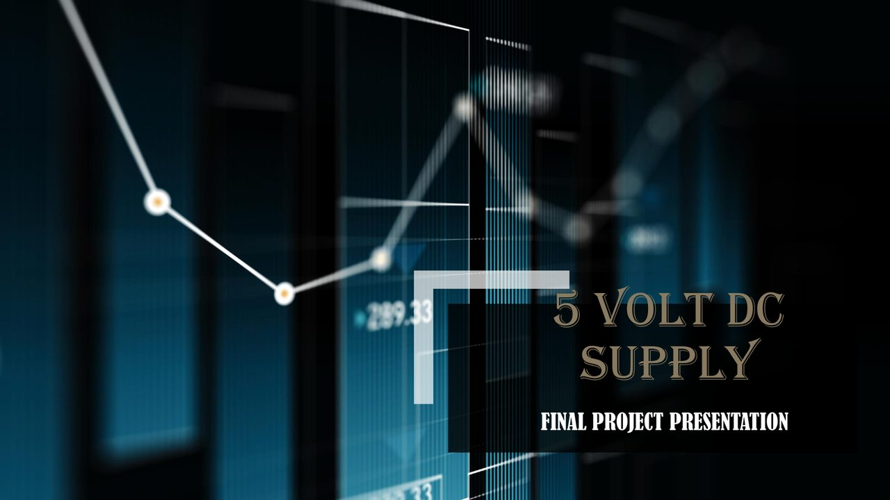

### 2. Objectives

Design / analyse a logical power-conversion circuit; identify apparatus; ground the work in rectifier + regulator theory.

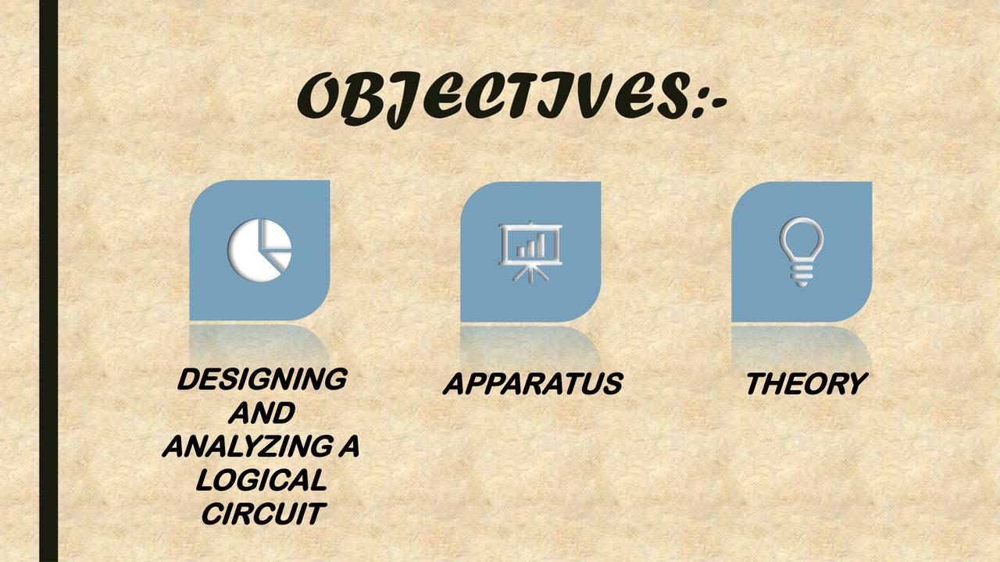

### 3. Introduction

Why 5 V DC matters, regulated vs unregulated supplies, and framing this practical as **AC → DC** power electronics.

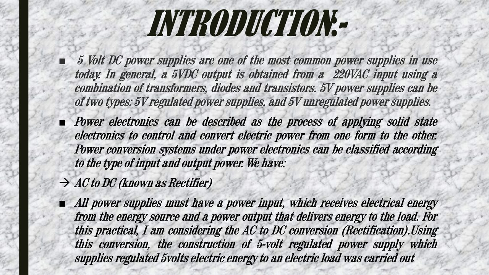

### 4. Apparatus list

Bill of materials as written in the PDF: mains, breadboard, transformer, bridge, filter, LM7805, 1 kΩ, LED.

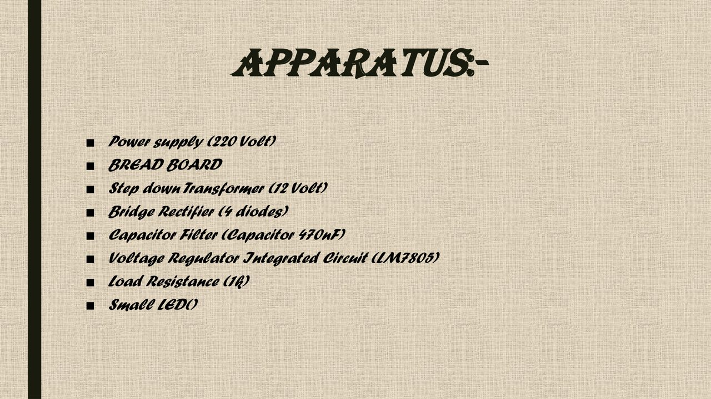

### 5. Apparatus images

Photo collage of physical parts used for the breadboard build (image-heavy slide).

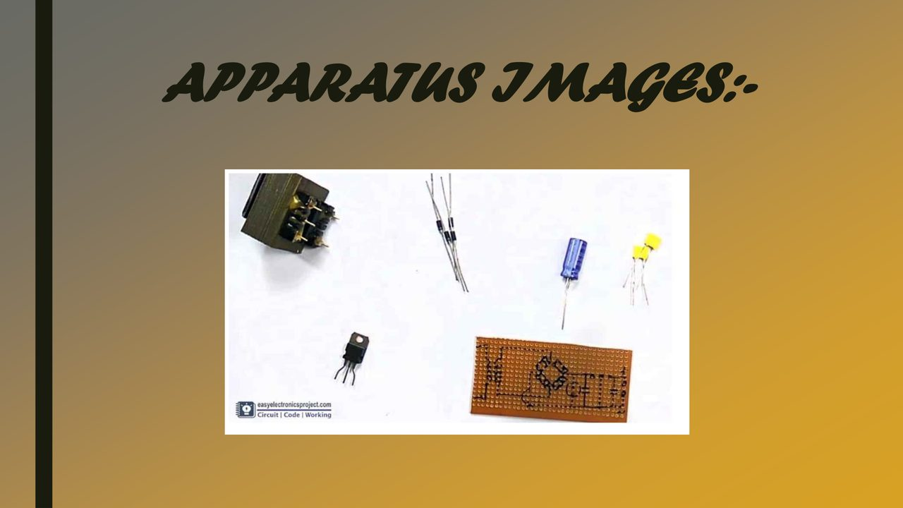

### 6. Transformer stage

Step-down / isolation stage: 220/230 V primary → low-voltage secondary before rectification.

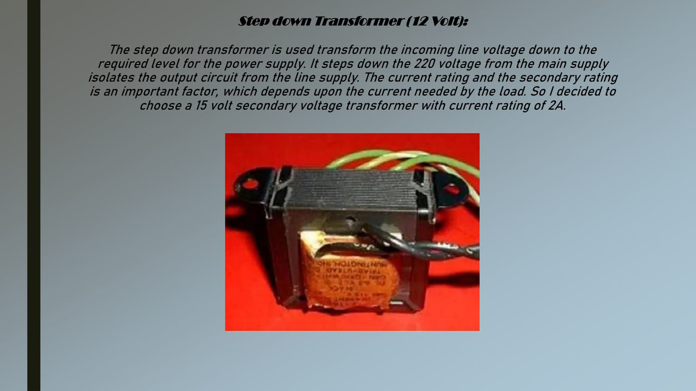

### 7. Bridge rectifier

Four-diode **1N4007** bridge converting AC secondary into pulsating DC.

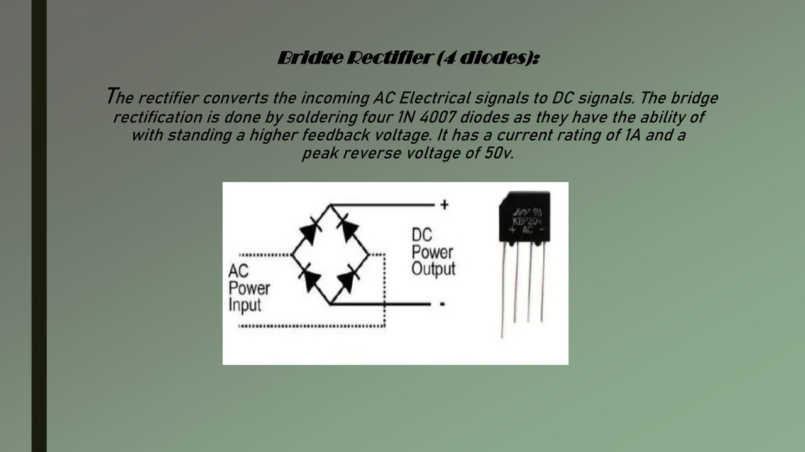

### 8. Capacitive filter

Filter capacitor “fills the troughs” of the rectified waveform so the regulator sees smoother DC.

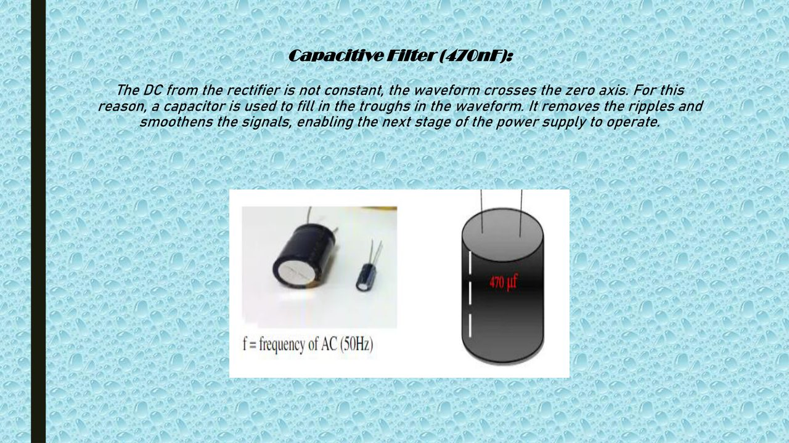

### 9. LM7805 regulator

Linear regulator stage: holds ≈5 V at the output within the IC’s dropout / input window.

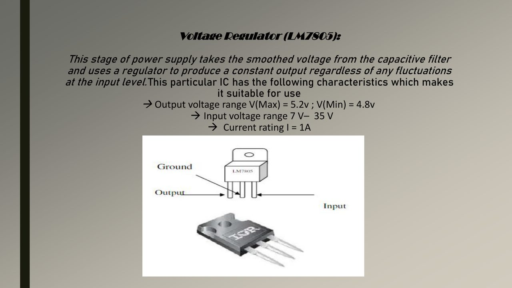

### 10. Load and LED

1 kΩ base load plus LED indicator behaviour under a real resistive load.

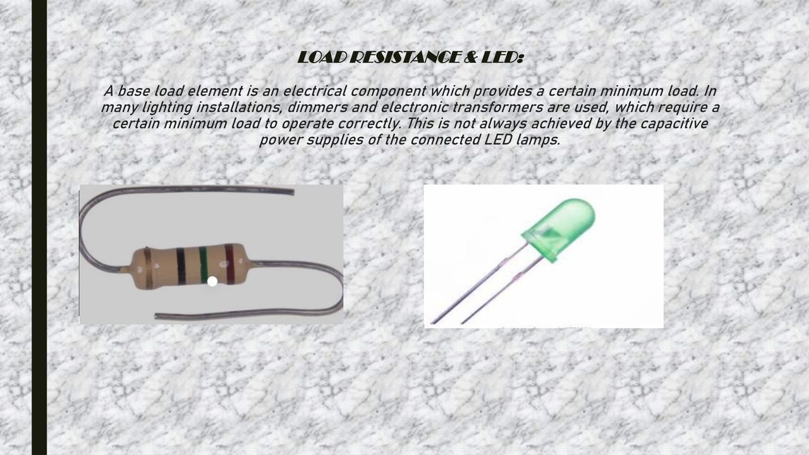

### 11. Four-step conversion

Teaching sequence: step down → rectify → filter → regulate (230 V AC path toward 5 V DC).

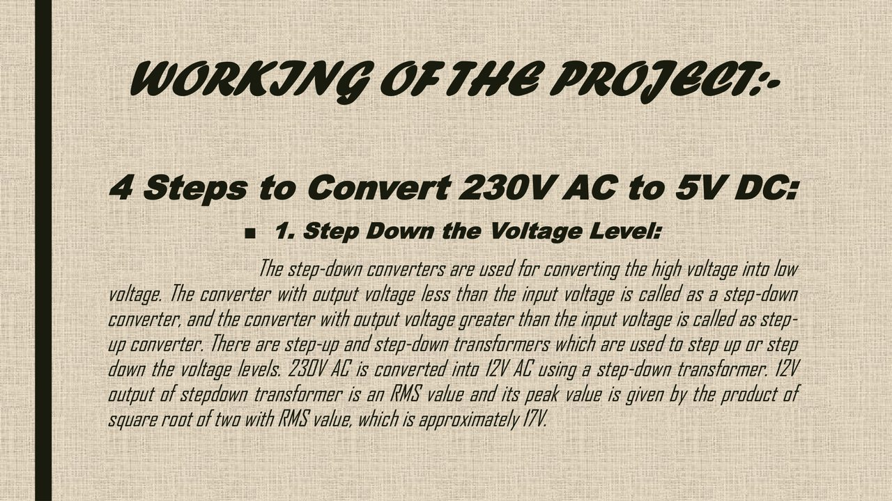

### 12. Regulation and heat sink

Headroom / thermal notes for the 7805 when input DC sits several volts above 5 V.

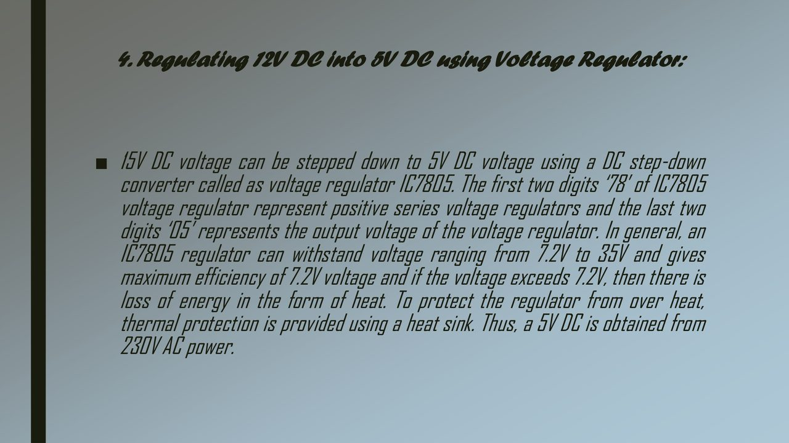

### 13. Proteus simulation

Simulation schematic / Proteus capture embedded in the presentation (image-only slide).

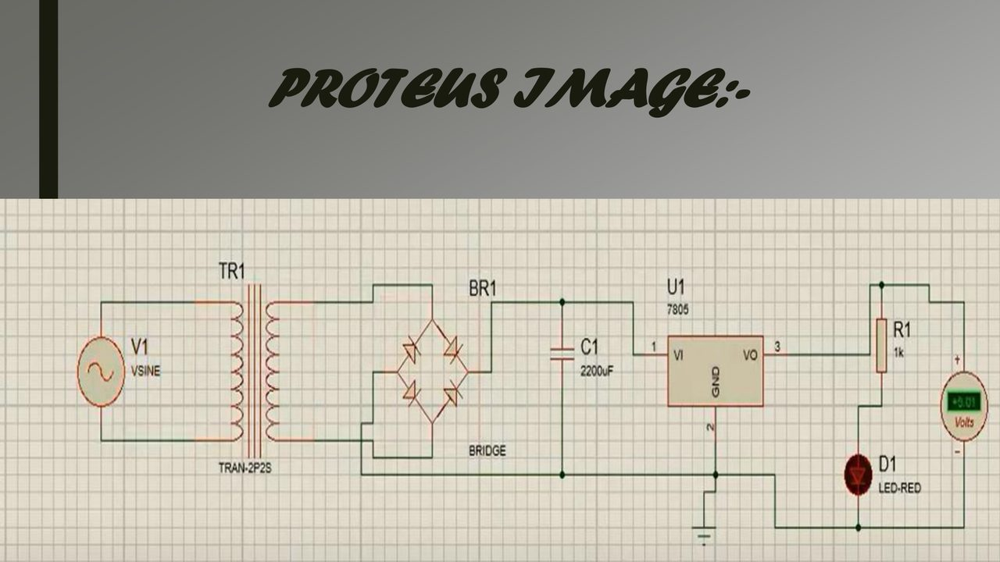

### 14. Hardware breadboard

Physical build photographed on **5 Dec 2022** — transformer secondary into the breadboard regulator chain.

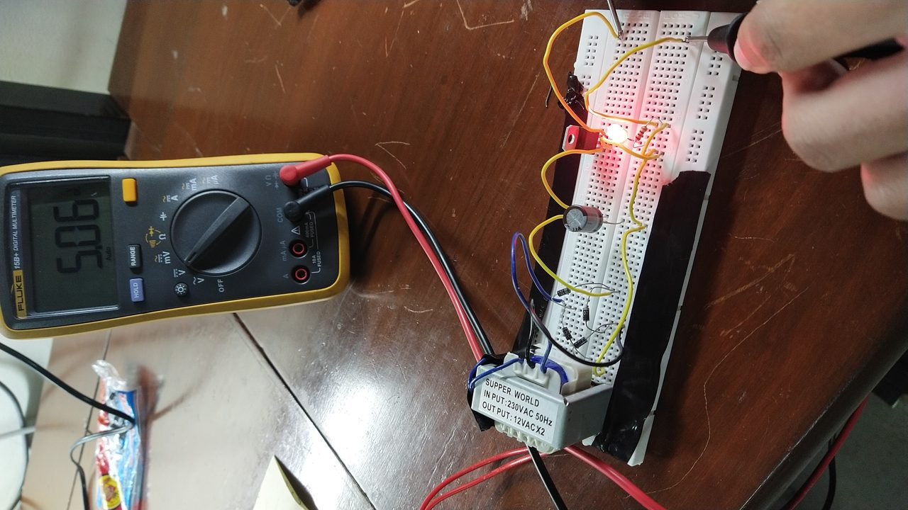

### 15. Measured result — 5.06 V

Results slide: DMM across the load reads **5.06 V**, confirming regulation near the 5 V target.

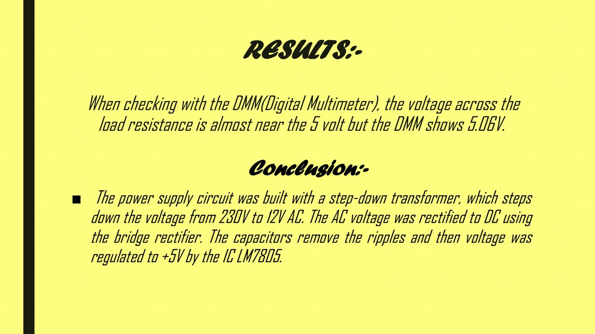

---

## Deep feature walkthrough

### Feature A — Title and scope

The deck is a **final project presentation**, not a product datasheet. It packages objectives, apparatus, theory, a four-step conversion narrative, Proteus evidence, hardware photos, and one DMM reading. Use it as a lab narrative: what was intended, what was built, what was measured.

### Feature B — Objectives

Objectives emphasise **design + analysis** of a complete AC–DC chain, not a single component demo. That drives the slide order: apparatus → transformer → rectifier → filter → regulator → load → measured result.

### Feature C — Introduction (regulated vs unregulated)

The introduction contrasts:

- **Unregulated** 5 V-ish rails that sag with load and ripple with line.
- **Regulated** 5 V held by an IC (here **LM7805**) once the input stays above dropout.

Pedagogically this sets why a bare bridge + capacitor is not enough for logic / USB-style loads.

### Feature D — Apparatus as a contract

Treat the apparatus table as the **preferred build contract** when slides disagree:

| Item | Preferred reading |
|------|-------------------|
| Mains | 220–230 V AC (lab supply) |
| Prototype | Breadboard (Veroboard recommended in text; breadboard used) |
| Transformer | Step-down **12 V** secondary (one slide claims 15 V / 2 A chosen) |
| Rectifier | **Bridge**, four **1N4007** |
| Filter | Capacitor (PDF heading says **470 nF**; see inconsistencies) |
| Regulator | **LM7805** / IC7805 |
| Load | **1 kΩ** + LED |

### Feature E — Transformer

Purpose: **voltage step-down** and **galvanic isolation** from mains. Current rating must exceed load current. Peak secondary ≈ \(V_{\mathrm{RMS}}\sqrt{2}\) (e.g. 12 V RMS ≈ 17 V peak) before diode drops.

### Feature F — Bridge rectifier

Four diodes arranged so both AC half-cycles feed the filter with the same polarity. PDF names **1N4007**, 1 A. Written PIV of 50 V conflicts with typical 1N4007 datasheet PIV (1000 V) — always check the part you hold.

### Feature G — Capacitive filter

Without a reservoir capacitor, the bridge output dips toward zero each half-cycle. The capacitor charges near the peaks and discharges into the load/regulator between peaks, reducing ripple. Teaching labs often use hundreds of **µF**; this PDF literally says **470 nF** — rebuild carefully and prefer a sized electrolytic if supervisors allow.

### Feature H — LM7805

Linear positive regulator, “78” series, “05” = 5 V. Written windows:

- Output roughly **4.8–5.2 V**
- Input roughly **7–35 V** (elsewhere **7.2 V** minimum)
- About **1 A** class (with thermal limits)

The IC drops the excess voltage as heat: \(P \approx (V_{\mathrm{in}}-5)\times I_{\mathrm{load}}\). Heat sinks matter when Vin is high or load current rises.

### Feature I — Load and LED

A defined **1 kΩ** load makes the measurement repeatable. The LED confirms the rail is alive; series current limiting must be respected so the LED does not overcurrent.

### Feature J — Four-step conversion narrative

Pages 14–17 teach:

1. **Step down** 230 V AC → ~12 V AC RMS  
2. **Rectify** to pulsating DC  
3. **Filter** to smoother DC  
4. **Regulate** to +5 V with IC7805  

One paragraph incorrectly says a **two-diode** full-wave rectifier; the apparatus and hardware intent remain a **four-diode bridge**. Prefer apparatus + results when rebuilding.

### Feature K — Thermal / headroom notes

The deck discusses dropout (~7–7.2 V input) and heat-sink use. This is the difference between “it lights an LED” and “it survives a longer lab session”.

### Feature L — Proteus simulation

Slide labelled **PROTEUS IMAGE** is a schematic / sim capture inside the PDF. There is **no** checked-in `.pdsprj` file — the screenshot is the simulation evidence.

### Feature M — Hardware breadboard

`IMG_20221205_163654.jpg` and the live MP4s are the physical proof: transformer secondary, breadboard wiring, regulator package, LED/load region. Compare orientation of the 7805 and capacitor polarity against the apparatus list.

### Feature N — Measured 5.06 V

Closing result: DMM across the load ≈ **5.06 V**. That is the success criterion for this archive — regulation near 5 V under the documented load — not a full load-regulation curve.

---

## Block diagram (signal path)

```text
230 V AC mains
      │
      ▼
 Step-down transformer  →  ~12 V AC (isolated)
      │
      ▼
 Bridge rectifier (4 × 1N4007)  →  pulsating DC
      │
      ▼
 Capacitive filter  →  smoother DC (~12–15 V region)
      │
      ▼
 LM7805 regulator  →  ~5.0 V DC
      │
      ▼
 1 kΩ load + LED   →  measured 5.06 V on DMM
```

---

## PDF metadata

| Field | Value |
|-------|--------|
| Title | 5 VOLT DC SUPPLY |
| Author | Mohammad Rohaan |
| Producer / Creator | Microsoft PowerPoint LTSC |
| Creation / mod date | 2022-12-07 03:04:29 +05:00 |
| Pages | 20 |

Image-heavy slides with little extractable text: **APPARATUS IMAGES** (p. 6–7), **PROTEUS IMAGE** (p. 18), **HARDWARE IMAGE** (p. 19). Feature screenshots above cover those visually.

---

## Objectives and introduction

**Objectives (p. 3):** design and analyse the circuit; list apparatus; apply theory.

**Introduction (p. 4):** 5 V DC rails are common; obtain 5 V from 220 VAC using transformers, diodes, and regulation; distinguish regulated vs unregulated; treat the practical as **AC to DC (rectification)** ending in a regulated 5 V load supply.

---

## Apparatus list

See Feature D above and screenshot **04**. LM7805 characteristics as written on p. 11: output 4.8–5.2 V, input 7–35 V (p. 17 also 7.2–35 V), ~1 A. Page 12 contrasts breadboard (temporary) vs Veroboard (soldered); **breadboard used**.

---

## Stage-by-stage theory

| Stage | PDF focus | Role |
|-------|-----------|------|
| Transformer (p. 8) | 12 V vs 15 V / 2 A wording | Step-down + isolation |
| Bridge (p. 9) | 4 × 1N4007 | AC → pulsating DC |
| Filter (p. 10) | Capacitive filter | Ripple reduction |
| LM7805 (p. 11) | Fixed 5 V | Regulation |
| Load / LED (p. 13) | 1 kΩ + indicator | Defined load + visual check |

---

## Conversion procedure

Four teaching steps (p. 14–17): step down → rectify → filter → regulate. Peak estimate \(12\sqrt{2}\approx 17\) V before diode drops. Heat-sink guidance when Vin stays high above 5 V. Prefer **bridge + LM7805 + 5.06 V result** over the “2 diode full-wave” paragraph.

---

## Measured result

> When checking with the DMM (Digital Multimeter), the voltage across the load resistance is almost near the 5 volt but the DMM shows **5.06 V**.

Conclusion on the same slide: 230 V → 12 V AC → bridge DC → capacitors smooth → **LM7805** → **+5 V**.

---

## Inconsistencies in the write-up

These conflicts are **inside the PDF**, not invented here:

| Topic | One slide says | Another slide says |
|-------|----------------|--------------------|
| Mains | 220 V | 230 V |
| Secondary | 12 V | 15 V / 2 A chosen |
| Rectifier | Bridge, **4** diodes (1N4007) | Full-wave, **2** diodes |
| Filter value | **470 nF** | Typical labs use hundreds of **µF** |
| 7805 input min | 7 V | 7.2 V |

**Rebuild rule:** follow apparatus list + hardware photos + **5.06 V** result; treat conflicting textbook paste as non-authoritative.

---

## Repository layout

```text
Circuit-Analysis/
├── README.md                      ← this document
├── LICENSE
├── TREE.txt
├── .gitattributes
├── 5 VOLT DC SUPPLY.pdf           ← graded 20-slide deck
├── IMG_20221205_163654.jpg        ← hardware photo
├── IMG-20221207-WA0006.jpeg       ← additional photo
├── video_20221205_163544.mp4      ← live demo (primary)
├── video_20221205_163700.mp4      ← live demo (secondary)
└── docs/screenshots/              ← 15 feature screenshots (01–15)
```

Original media filenames and dates are preserved. Screenshots are regenerated from the PDF + hardware photo for README clarity.

---

## How to use the archive

1. Open the [Live demo](#live-demo) video links (full URLs listed there — no “click here”).
2. Read `5 VOLT DC SUPPLY.pdf`; zoom Proteus / hardware pages.
3. Skim the [Feature screenshots](#feature-screenshots) section for a visual map of every stage.
4. Compare `IMG_20221205_163654.jpg` to the apparatus list (7805 orientation, cap polarity, LED, transformer leads).
5. Nothing to compile — PDF reader + image viewer + video player only.

---

## Safety

Documentation only. If you rebuild in a **supervised** lab:

- Fuse the transformer primary; never touch the 220/230 V side without supervision.
- Respect electrolytic **polarity** if a large reservoir capacitor is used.
- Keep 7805 **headroom** and add a **heat sink** when Vin is high.
- Verify diode PIV from the **datasheet** for the parts you buy.
- This repo is not a substitute for lab safety training.

---

## Limitations

- No checked-in Proteus project, KiCad/Eagle sources, BOM CSV, or scope captures.
- Theory slides mix 2-diode vs 4-diode text and 12 V vs 15 V secondary.
- Only one tabulated DMM point (**5.06 V**), not a full load/line regulation suite.
- Filter caption **470 nF** may not match common lab practice — verify before rebuild.

**Not in this repo:** firmware, MATLAB, or PCB Gerbers.

---

## Author

**Mohammad Rohaan** · Roll **22I-2327**  
Group: Taha Sajid Awan (22I-2302), Talha Tariq (22I-2309)  
GitHub: [https://github.com/rohaan2802](https://github.com/rohaan2802)  
Repository: [https://github.com/rohaan2802/Circuit-Analysis](https://github.com/rohaan2802/Circuit-Analysis)
